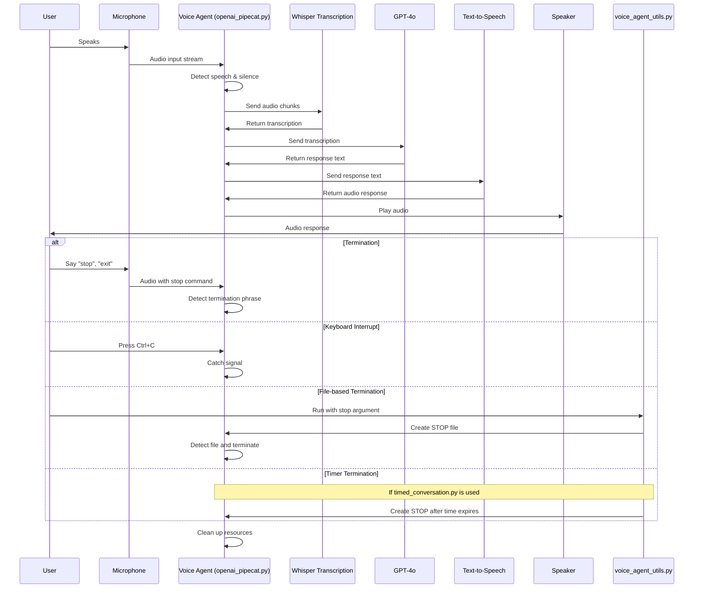
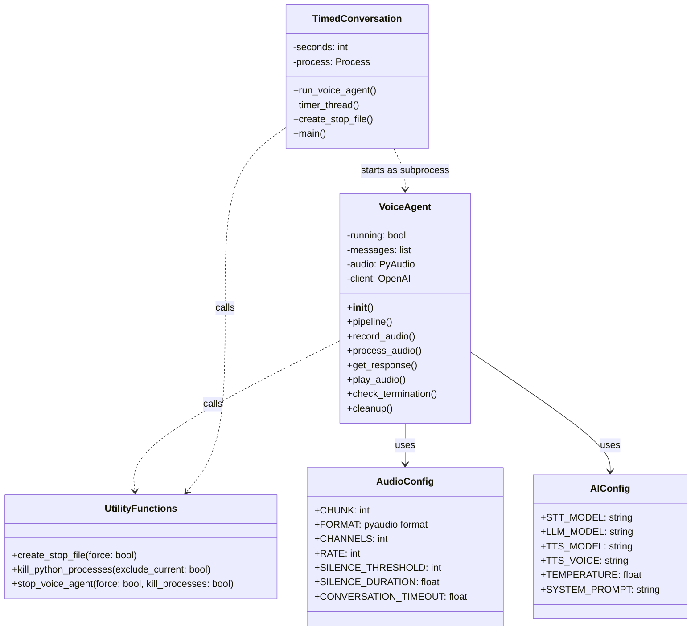

# Voice Agent Documentation

## Overview
This repository contains a voice-based conversational AI agent built with OpenAI's APIs. The system enables natural voice interaction with an AI assistant by handling speech detection, transcription, response generation, and voice output.

## System Architecture

```mermaid
graph TD
    subgraph "Core Components"
        A[timed_conversation.py] -->|Subprocess| B[openai_pipecat.py]
        B -->|Uses| C[voice_agent_utils.py]
        A -->|Uses| C
    end

    subgraph "Voice Agent Pipeline"
        D[Microphone Input] -->|Audio Stream| E[Speech Detection]
        E -->|Audio Chunks| F[OpenAI Whisper API]
        F -->|Transcription| G[GPT-4o]
        G -->|Text Response| H[OpenAI TTS API]
        H -->|Audio Response| I[Speaker Output]
    end

    subgraph "Termination Methods"
        J[Keyboard Interrupt] -->|Signal| K[Termination Handler]
        L[Voice Commands] -->|"stop", "exit"| K
        M[STOP/FORCE_STOP Files] -->|File Detection| K
        N[Timer] -->|Time Limit| K
        K -->|Cleanup| O[Resource Release]
    end

    B -->|Controls| Voice Agent Pipeline
    B -->|Monitors| Termination Methods
    C -->|Creates| M
    A -->|Manages| N
    
    classDef primary fill:#4CAF50,stroke:#388E3C,color:white;
    classDef secondary fill:#2196F3,stroke:#1976D2,color:white;
    classDef tertiary fill:#FF9800,stroke:#F57C00,color:white;
    
    class A,B,C primary;
    class D,E,F,G,H,I secondary;
    class J,K,L,M,N,O tertiary;
```

## Data Flow



## Code Structure



## Core Components

### 1. Main Voice Agent (`openai_pipecat.py`)
The primary application file that implements the voice conversation pipeline:
- Handles audio input/output through your microphone and speakers
- Detects speech and silence using adaptive thresholds
- Transcribes speech using OpenAI's models
- Generates responses via OpenAI's chat models
- Outputs responses through text-to-speech
- Monitors for termination signals (keyboard interrupts, stop files)

```bash
# Run the voice agent with default settings
python openai_pipecat.py

# Stop the voice agent
python openai_pipecat.py stop

# Force stop the voice agent
python openai_pipecat.py stop --force

# Kill all Python processes (emergency use only)
python openai_pipecat.py kill
```

### 2. Utility Module (`voice_agent_utils.py`)
A shared library that provides control functions for the voice agent:
- Creates STOP/FORCE_STOP files to signal termination
- Contains functions to manage Python processes
- Provides unified interfaces for stopping the voice agent

```bash
# Can be used directly to stop a running voice agent
python voice_agent_utils.py
python voice_agent_utils.py --force
python voice_agent_utils.py --kill
```

### 3. Timed Conversation Script (`timed_conversation.py`)
A wrapper script that runs the voice agent for a specified duration:
- Takes command-line arguments to set a custom time limit
- Creates a subprocess to run the main voice agent
- Automatically terminates the conversation after the time limit
- Ensures proper cleanup of resources

```bash
# Run the voice agent for 60 seconds (default)
python timed_conversation.py

# Run the voice agent for a custom duration (e.g., 30 seconds)
python timed_conversation.py --time 30
```

## How It Works

1. The system monitors audio input for speech using adaptive thresholds.
2. When speech is detected, the audio is streamed to OpenAI's models for transcription.
3. The transcribed text is sent to an OpenAI chat model to generate a response.
4. The response is converted to speech and played back to the user.
5. The conversation continues until the user stops it or a silence timeout occurs.

## Termination Methods

The voice agent can be terminated in multiple ways:
- **Voice Commands**: Say "stop," "exit," "quit," or similar phrases
- **Keyboard Interrupt**: Press Ctrl+C while the program is running
- **Stop Files**: Create a STOP or FORCE_STOP file in the project directory
- **Time Limit**: When using timed_conversation.py, the agent stops after the specified time
- **Emergency Kill**: Use the kill functionality to terminate all Python processes

## Requirements

The following dependencies are required:

- Python 3.9+
- OpenAI API key
- Microphone and speakers
- Operating system: Windows, macOS, or Linux

## Installation

1. Clone the repository
   ```bash
   git clone https://github.com/yourusername/Voice-Agent.git
   cd Voice-Agent
   ```

2. Create and activate a virtual environment
   ```bash
   # On Windows
   python -m venv voice-agent
   voice-agent\Scripts\activate
   
   # On macOS/Linux
   python -m venv voice-agent
   source voice-agent/bin/activate
   ```

3. Install dependencies
   ```bash
   pip install -r requirements.txt
   ```

4. Create a `.env` file in the project root with your OpenAI API key
   ```
   OPENAI_API_KEY=your_api_key_here
   ```

## Usage

The Voice Agent can be run in several ways:

### Standard Mode

Run the voice agent with manual termination:

```bash
python openai_pipecat.py
```

You can stop the conversation by:
- Saying "stop", "exit", "quit", or similar termination phrases
- Pressing Ctrl+C
- Running `python openai_pipecat.py stop`

### Timed Mode

Run the voice agent with automatic termination after a specified time:

```bash
# Run for 60 seconds (default)
python timed_conversation.py

# Run for a custom duration (e.g., 120 seconds)
python timed_conversation.py --time 120
```

### Emergency Termination

If the voice agent doesn't respond, you can use built-in kill functionality:

```bash
# Gracefully stop the voice agent
python openai_pipecat.py stop

# Force stop the voice agent 
python openai_pipecat.py stop --force

# Kill all Python processes
python openai_pipecat.py kill
```

## Configuration

The Voice Agent can be configured by modifying the following classes in `openai_pipecat.py`:

### Audio Configuration

```python
class AudioConfig:
    CHUNK = 1024
    FORMAT = pyaudio.paInt16
    CHANNELS = 1
    RATE = 24000
    SILENCE_THRESHOLD = 1000  # Adjust for speech detection sensitivity
    SILENCE_DURATION = 0.8    # How long silence must persist to end utterance
    CONVERSATION_TIMEOUT = 8.0  # Seconds of silence to end conversation
    INTERRUPTION_THRESHOLD = 1200  # Threshold for interruption detection
```

### AI Model Configuration

```python
class AIConfig:
    STT_MODEL = "whisper-1"    # Speech-to-text model
    LLM_MODEL = "gpt-4o"       # Language model
    TTS_MODEL = "tts-1"        # Text-to-speech model
    TTS_VOICE = "nova"         # Voice for speech synthesis
    TEMPERATURE = 0.7          # Response creativity
    SYSTEM_PROMPT = "..."      # System prompt for the language model
```

## Troubleshooting

### Voice Not Detected

If your voice is not being detected:
- Try increasing the microphone volume in your system settings
- Decrease the `SILENCE_THRESHOLD` in the `AudioConfig` class
- Make sure your microphone is working and properly connected

### AI Responses Not Interrupted

If you can't interrupt the AI's responses:
- Decrease the `INTERRUPTION_THRESHOLD` in the `AudioConfig` class
- Speak louder when interrupting

### Process Not Terminating

If the voice agent doesn't terminate properly:
- Use `python openai_pipecat.py stop --force` to force termination
- As a last resort, use `python openai_pipecat.py kill` to kill all Python processes

## Development

### Code Structure

- `openai_pipecat.py`: Main voice agent implementation with integrated control functionality
- `voice_agent_utils.py`: Utility functions for controlling the voice agent
- `timed_conversation.py`: Run the voice agent with a time limit

### Adding Features

To extend the Voice Agent, follow these guidelines:

1. Keep each component focused on a single responsibility
2. Maintain error handling and resource cleanup
3. Update documentation for new features
4. Add appropriate type hints for new functions and methods

## License

[MIT License](LICENSE)

## Contributing

Contributions are welcome! Please feel free to submit a Pull Request.

1. Fork the repository
2. Create your feature branch (`git checkout -b feature/amazing-feature`)
3. Commit your changes (`git commit -am 'Add some amazing feature'`)
4. Push to the branch (`git push origin feature/amazing-feature`)
5. Open a Pull Request

## Acknowledgements

- OpenAI for providing the API services
- PyAudio for audio processing capabilities 